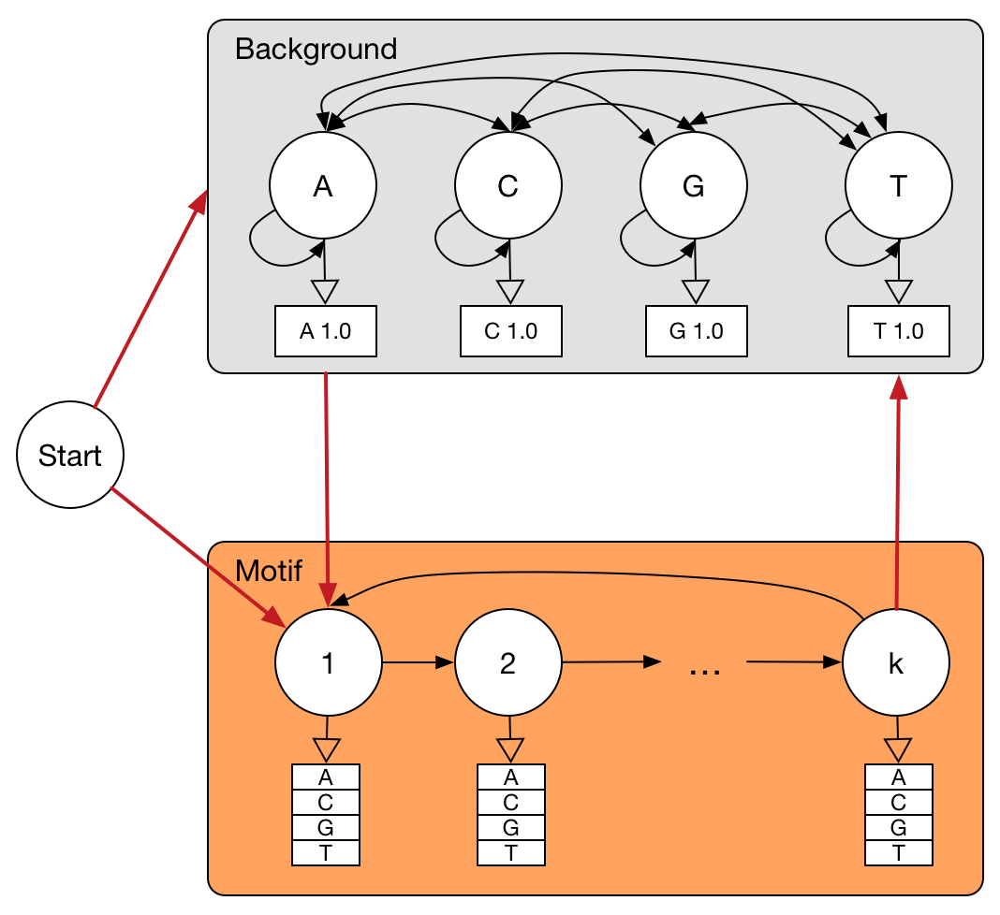

# pyHMM

Python library for Hidden Markov models (HMMs) training with Baum-Welch algorithm and decoding with Viterbi algorithm. 

Usages:

```
hmm.HMM(symbols, states, start_prob, transition_mat, emission_mat)
    HMM class initialization.
    Parameters:
        symbols: list, emission symbols
        states: list, hidden states
        start_prob: numpy.ndarray, start probability to each state
        transition_mat: numpy.ndarray, transition matrix between each pair of states
        emission_mat: numpy.ndarray, emission matrix for a state emit a symbol

hmm.sample(length, size=1)
    Sampling a give size of observations using HMM.
    Parameters:
        length: int, the length of a simulated observations sequence
        size: int, how many sequences to simulated, default 1
    Returns:
        samples: a list of list contains simulated sequences
        states: a list of list contains true states path

hmm.loglikelihood(data):
    Calculate the loglikelihood of give set of observations.
    Parameters:
        data: list of sequences of observations.
    Returns:
        the loglikelihood of all sequences

hmm.bw_train(data, update='ste', max_iter=100, d=1e-9):
    Run Baum-Welch algorithm on a give set of training data.
    Parameters:
        data: a set of training data
        update: indicate which parameter to update
        max_iter: the maximum iterations
        d: a threshod to check whether we can stop
    Returns:
        logll_all_iter: the loglikelihoods for each iteration
        diff_all_iter: the difference of the update parameters and old parameters

hmm.viterbi(obs):
    Run viterbi algorithm to find the most likely states path.
    Parameters:
        obs: a give sequence of observations
    Returns:
        v_path: a list of most likely states path
```

The multiplication of probabilities is done through [log-sum-exp trick](https://en.wikipedia.org/wiki/LogSumExp) to avoid numerical underflow.

## Applications on Computational Biology

The DNA sequence motif detection problem is defined as

> A motif is a short DNA sequence pattern that occurs repeatedly in certain sequences.
 
We want to use a HMM to model the motif then search motifs in new sequences.

For a *k*-length motif, the HMM has two regions: *Background* and *Motif.* *Background* consists of four states A, C, G and T, and the four states are fully connected, allow transition between any of the states. *Motif* consists of *k* states, for 1st, 2nd, ..., *k*-th positions in a *k*-length motif, the transition could only happend in the order of 1st to 2nd, 2nd to 3rd, etc., except for *k*-th could transit to 1st. Any state in *Background* could transit to 1st state in *Motif*, and *k*-th state in *Motif* could transit to any state in *Background*. The start state could transit to any state in *Background* and 1st state in *Motif*.



Training data was obtained from TFBS (**T**ranscription **F**actor **B**inding **S**ite) profile database [JASPAR](http://jaspar.genereg.net/), and HMM was trained on the training data using Baum-Welch algorithm.

The transition probabilities between states in *Background* were estimated from empirical dinucleotide distribution. Any state in *Background* only emit itself. The emission probabilities of states in *Motif* were estimated from PWM (**P**osition **W**eight **M**atrix) from JASPAR.
